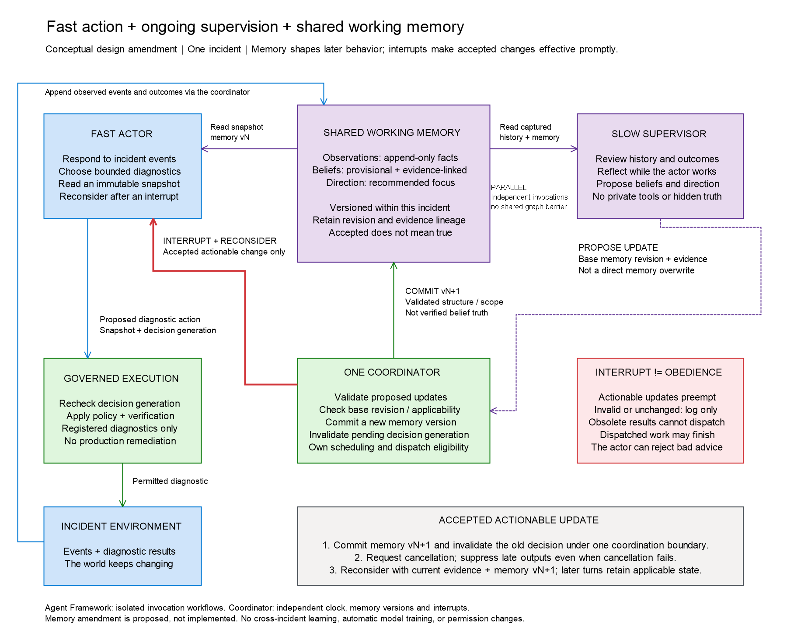

# Governed Deliberation Study

Can a slower supervisor improve a fast agent's behavior while the agent keeps
responding to a changing environment? This study explores that question through
synthetic incident diagnostics, comparing responsiveness, investigative progress,
and the cost of correction. It is a bounded research project, not an agent platform.

**Fast action, ongoing reflection, fixed authority.** A supervisor proposes
evidence-linked beliefs and time-bound direction; an independent coordinator
validates updates and interrupts obsolete decisions. Agreement is not authority:
neither model can change the controls governing execution.


## Research questions

| Question | What we examine |
| --- | --- |
| In which incident conditions does ongoing supervision improve the actor's trajectory? | Goal progress, supported diagnoses, and unnecessary or repeated actions. |
| What is the responsiveness and resource trade-off of asynchronous versus blocking review? | Response latency, deadlines met, review lag, and total inference cost. |
| When does feedback change behavior beneficially, and when does it mislead? | Useful corrections, stale or incorrect advice, and the actions that follow it. |
| Do execution constraints remain enforced across decision strategies? | Actual attempts, control decisions, and observed side effects within the tested scope. |

## Study design

Compare **actor-only**, **blocking supervision** (wait at review checkpoints),
and **asynchronous supervision** (continue permitted work while review is pending).
Keep actor configuration and execution controls constant; use the same supervisor
and memory rules in both supervised conditions.

The first episode investigates elevated errors in a Payments API. Evidence
arrives over time: an incident alert, healthy local instances, and dependency
timeouts, followed by dependency diagnostics available on request and a
cache-warning comparison digest. The development schedule releases these at logical ticks
0, 4, 8, 12, and 16, with an exclusive horizon of 24. Neither component receives
future evidence or the answer key. The episode ends at a diagnosis and justified
next step, **not executed remediation**.

Measure diagnostic support, progress, repeated work, response times, guidance
influence, interruptions, and resource use. Include routine cases where supervision
does not help, as well as wrong or late advice. More details are in the
[experiment specification](docs/EXPERIMENT_SPEC.md) and
[development evidence sequence](docs/governance/research-history.md#draft-evidence-sequence-payments-investigation).

Scripted logical-time runs can establish mechanics and compare behavior under
declared duration assumptions. They cannot establish real-model responsiveness
or cost advantages: answering the responsiveness question empirically requires
measured model latencies and an independently scheduled evolving environment.
The live-model timing methodology is not yet fixed.

### Shared memory and interruption



**Memory makes corrections persist; interruption makes them effective promptly.**
Observations are immutable; beliefs remain provisional. Direction expires
separately from belief validity, and already-dispatched operations may finish.
The scripted runtime mechanism depicted here is implemented and exercised
end to end by the bounded ER-1 smoke test. The independent evaluator and
live-model execution are not implemented.

[Editable Excalidraw](docs/architecture/actor-supervisor-shared-memory.excalidraw)
| [SVG](docs/architecture/actor-supervisor-shared-memory.svg)

This comparison studies **supervision plus within-incident memory adaptation**,
not memory's isolated benefit. Timing can produce different observations and
memory states across runs. It does not demonstrate reinforcement-learning
training or universal safety.

## Current status

T0-T3 are implemented, reviewed, and published: isolated Agent Framework
invocations, strict research contracts, the deterministic evolving-evidence
scheduler, and one coordinator for actor-only, blocking, and asynchronous
supervision. A narrow scripted smoke checkpoint runs the straightforward ER-1
fixture twice under each architecture, persists validated records and timelines,
and checks repeated-run reproducibility.

This establishes scripted mechanism behavior only. The C6 evidence-support and
next-step rubric, A02 competent-actor case, independent T4 evaluator, T5
acceptance package, and live-model methodology remain deferred. **There are no
comparative model-performance results yet.**

## Run the existing work

Use PowerShell 7, the .NET SDK specified in `global.json`, and Node.js 22 or newer.
From the repository root:

```powershell
npm ci
dotnet tool restore
pwsh .\scripts\test-t0-feasibility.ps1
dotnet test .\tests\GovernedAgent.UnitTests\GovernedAgent.UnitTests.csproj --configuration Release --filter FullyQualifiedName~ResearchContractTests
dotnet test .\tests\GovernedAgent.UnitTests\GovernedAgent.UnitTests.csproj --filter FullyQualifiedName~ScriptedExperimentSchedulerTests
dotnet test .\tests\GovernedAgent.IntegrationTests\GovernedAgent.IntegrationTests.csproj --filter FullyQualifiedName~ScriptedSupervisionCoordinatorTests
dotnet test .\tests\GovernedAgent.IntegrationTests\GovernedAgent.IntegrationTests.csproj --filter FullyQualifiedName~Er1StraightforwardSmokeRun --logger "console;verbosity=normal"
```

The smoke command runs six scripted episodes: two repetitions each for
actor-only, blocking, and asynchronous supervision. It writes validated
mechanism records under the ignored
`.artifacts\deliberation-study\smoke-er1\` directory. These commands do not run
live models or score comparative benefit. For full repository validation,
including the inherited proof checks, use `pwsh .\scripts\validate.ps1`; see
the [local setup details](docs/T0_FEASIBILITY.md#reproduce).

## Read more

- [Discussion pitch](docs/pitch.html) — keep its adjacent `assets` folder when copying it.
- [Related work and positioning](docs/related-work.md).
- [Experiment specification](docs/EXPERIMENT_SPEC.md) and [serialized contract reference](docs/T1_CONTRACT_PROPOSAL.md).
- [Approved ER-1 fixture](docs/ER1_FIXTURE_PROPOSAL.md) and [scripted smoke-run specification](docs/SCRIPTED_SMOKE_RUN_PROPOSAL.md).
- [Framework feasibility evidence and limitations](docs/T0_FEASIBILITY.md).
- [Implementation sequence and current gate](docs/governance/COPILOT_HANDOFF.md).
- [Open design questions](docs/open-design-questions.md).
- [Development process and decision history](docs/governance/process.md).
- [Inherited documentation archive](docs/archive/README.md).

Derived from [agentic-harness-validation](https://github.com/katarinasvedman-ms/agentic-harness-validation)
at [`ebe882a`](https://github.com/katarinasvedman-ms/agentic-harness-validation/commit/ebe882a7b9cb30544292c03c166f466e46a5eee1),
with the original history retained.
