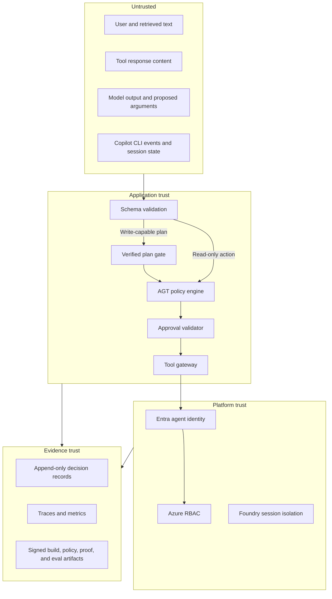

# Functional Requirements Document: Governed Enterprise Agent Demo

| Field | Value |
| --- | --- |
| Status | Draft |
| Version | 0.2 |
| Date | 2026-08-12 |
| Parent document | [Product Requirements Document](PRD.md) |
| Companion documents | [Threat Model](../THREAT_MODEL.md), [Verification Specification](../VERIFICATION_SPEC.md) |

## 1. Purpose

This document translates the product requirements for the Governed Enterprise Agent Demo into implementable system behavior.

The system demonstrates an enterprise incident-response agent that can investigate an outage, propose remediation, request exact human approval, and execute only authorized actions. It must also demonstrate that prompt injection and unauthorized tool use are blocked outside the model.

## 2. Requirement terminology

The terms MUST, MUST NOT, SHOULD, SHOULD NOT, and MAY are used as normative requirement levels.

Each requirement has a stable identifier:

- `WF-*`: workflow
- `TRUST-*`: trust boundary
- `ID-*`: identity and authorization
- `POL-*`: runtime policy
- `APR-*`: human approval
- `TOOL-*`: governed tools
- `OBS-*`: telemetry and audit
- `EVAL-*`: evaluation
- `UX-*`: governance console
- `DEP-*`: deployment and supply chain
- `AC-*`: acceptance criteria

## 3. System context

### 3.1 Logical architecture

```mermaid
flowchart LR
    Operator[Incident operator] --> Console[Governance console]
    Commander[Incident commander] --> Console
    Console --> Endpoint[Foundry Hosted Agent endpoint]

    subgraph Hosted[Foundry Hosted Agent]
        Endpoint --> MAF[Microsoft Agent Framework]
        MAF --> Copilot[GitHub Copilot SDK agent]
        Copilot --> CLI[Copilot CLI agentic loop]
        CLI --> Model[Foundry model]
        CLI --> Hook[OnPreToolUse governance hook]
        Hook --> Planner[Structured plan builder]
        Planner --> Verify[Verified plan gate for writes]
        Verify --> Policy[AGT policy adapter]
        Policy --> Approval[Approval validator]
        Approval --> Gateway[Governed tool gateway]
        Gateway --> Recheck[Policy, approval, digest, and budget recheck]
    end

    Recheck --> Systems[Simulated operational systems]
    Hosted --> OTel[OpenTelemetry]
    OTel --> AppInsights[Application Insights]
    Hook --> Audit[Decision audit store]
    Recheck --> Audit

    Pipeline[CI/CD] --> Proofs[Dafny/LemmaScript verification]
    Pipeline --> Evaluations[Foundry evaluations]
    Pipeline --> PolicyTests[Policy and threat tests]
    Proofs --> ReleaseGate[Release gate]
    Evaluations --> ReleaseGate
    PolicyTests --> ReleaseGate
    ReleaseGate --> Hosted
```



### 3.2 Technology allocation

| Concern | Initial technology |
| --- | --- |
| Managed runtime | Microsoft Foundry Hosted Agents |
| Inner agentic loop | GitHub Copilot SDK and Copilot CLI runtime |
| Outer composition | Microsoft Agent Framework on .NET |
| Model access | Microsoft Foundry model deployment |
| Runtime governance | Microsoft Agent Governance Toolkit .NET integration |
| Identity | Microsoft Entra agent identity |
| Infrastructure authorization | Azure RBAC |
| Verified plan logic | Restricted TypeScript with LemmaScript and Dafny |
| Governance console | React/TypeScript |
| Verified console state | Bounded lemmafit experiment |
| Telemetry | OpenTelemetry and Application Insights |
| Evaluation | Microsoft Foundry evaluations |
| High-assurance extension | Rust AGT SDK or Rust/Verus, post-MVP |

## 4. Components and responsibilities

### 4.1 Governance console

The governance console is the customer-facing interface. It MUST display:

- The incident conversation.
- Evidence retrieved by the agent.
- The proposed structured plan.
- Verification status and guarantee scope.
- Runtime policy decisions and reasons.
- Pending approvals and their exact scope.
- Tool execution status.
- Trace correlation and evaluation summaries.
- Kill-switch and circuit-breaker state.

The console MUST distinguish model-generated content from deterministic control decisions.

### 4.2 Hosted agent application

The Hosted Agent container MUST:

- Expose the Foundry Responses protocol unless implementation constraints require Invocations.
- Use Microsoft Agent Framework for the outer agent abstraction, application workflow, and future provider composition.
- Wrap GitHub Copilot SDK as an Agent Framework `AIAgent`.
- Let the Copilot CLI runtime own autonomous reason-act-observe turn iteration.
- Avoid a second Agent Framework tool loop around Copilot-owned tool execution.
- Generate structured plans for any operation that can mutate external state.
- Route all Copilot tool requests through `OnPreToolUse` governance.
- Disable Copilot built-in shell, filesystem, and unrestricted URL permissions.
- Emit OpenTelemetry spans and correlation identifiers.
- Fail closed when verification, policy, identity, or approval validation is unavailable.

### 4.3 Copilot agentic loop

The Copilot SDK integration MUST:

- Use the supported .NET Agent Framework integration.
- Register only explicit incident-response tools.
- Treat model output, tool requests, CLI events, and session state as untrusted inputs.
- Use `session.idle` as the reliable indication that the current loop stopped processing.
- Treat `session.task_complete` or equivalent model-declared completion as advisory only.
- Enforce turn, tool-call, time, token, and cost budgets outside model control.
- Support cancellation and deterministic failure propagation.
- Use non-interactive authentication suitable for a Hosted Agent.
- Store session state in an incident-scoped location that cannot cross session boundaries.

### 4.4 Verified plan gate

The verified plan gate MUST:

- Accept only the versioned canonical plan schema.
- Validate plan structure before any write-capable tool is invoked.
- Evaluate the invariants defined in [Verification Specification](../VERIFICATION_SPEC.md).
- Return `verified`, `rejected`, or `indeterminate`.
- Treat `indeterminate` as non-executable.
- Produce a machine-readable result and human-readable reason.
- Record verifier and specification versions.

### 4.5 Agent Governance Toolkit integration

AGT MUST act as an inline policy decision and enforcement point in both the Copilot pre-tool hook and the governed gateway.

The integration MUST:

- Evaluate the complete trusted action envelope, not only model-provided arguments.
- Canonicalize the same action fields and digest at both enforcement points.
- Apply default-deny policy.
- Return allow, deny, or require-approval.
- Prevent denied actions from reaching tool implementations.
- Create a decision record for every result.
- Reject malformed or incomplete envelopes.
- Support emergency deny-all policy activation.
- Treat a missing, failed, or replaced custom hook as deny.

Copilot's native permission request MUST NOT be treated as enterprise approval. The authoritative approval artifact is defined in section 5.3 and is revalidated by the gateway.

### 4.6 Governed tool gateway

The tool gateway MUST be the only application path to operational tools.

It MUST:

- Expose an explicit allowlist of tools.
- Validate tool arguments against schemas.
- Revalidate policy immediately before execution.
- Recompute and compare the canonical action digest produced at the pre-tool hook.
- Validate approval where required.
- Revalidate kill-switch state and action budgets immediately before execution.
- Enforce idempotency for writes.
- Apply timeouts, bounded retries, and response-size limits.
- Sanitize tool output before returning it to the model.
- Emit execution telemetry without leaking configured sensitive fields.

### 4.7 Operational-system simulator

The MVP MUST use simulated or isolated systems with deterministic seed data. It MUST NOT require customer production access.

The simulator MUST support:

- Service health and metrics queries.
- Log queries.
- Incident record read and update.
- A reversible service restart operation.
- Controlled fault injection.
- Reset to a known state.

## 5. Canonical data contracts

### 5.1 Action plan

The canonical plan MUST include:

```json
{
  "schemaVersion": "1.0",
  "planId": "uuid",
  "incidentId": "INC-1042",
  "agentId": "incident-agent",
  "deploymentVersion": "1.0.0",
  "createdAt": "RFC3339 timestamp",
  "expiresAt": "RFC3339 timestamp",
  "steps": [
    {
      "stepId": "step-1",
      "capability": "service.restart",
      "tool": "restart_service",
      "resource": {
        "type": "service",
        "id": "payments-api",
        "environment": "production",
        "classification": "internal"
      },
      "dataSources": [
        {
          "id": "payments-api-metrics",
          "classification": "internal"
        }
      ],
      "destination": {
        "id": "payments-api",
        "classification": "internal-trusted"
      },
      "arguments": {
        "instance": "payments-api-03"
      },
      "dependsOn": [],
      "effect": "write",
      "approvalClass": "incident-commander",
      "compensation": {
        "tool": "restore_service_state",
        "arguments": {
          "instance": "payments-api-03"
        }
      }
    }
  ]
}
```

Unknown fields MUST be rejected for security-relevant structures unless explicitly introduced by a newer supported schema.

### 5.2 Trusted action envelope

The policy engine MUST receive an envelope assembled by trusted application code:

```json
{
  "envelopeVersion": "1.0",
  "requestId": "uuid",
  "timestamp": "RFC3339 timestamp",
  "user": {
    "id": "entra-object-id",
    "roles": ["incident-operator"]
  },
  "agent": {
    "id": "incident-agent",
    "identity": "entra-agent-identity",
    "deploymentVersion": "1.0.0"
  },
  "session": {
    "id": "foundry-session-id",
    "incidentId": "INC-1042"
  },
  "action": {
    "planId": "uuid",
    "stepId": "step-1",
    "tool": "restart_service",
    "capability": "service.restart",
    "effect": "write",
    "resource": {
      "id": "payments-api",
      "environment": "production"
    },
    "actionDigest": "sha256"
  },
  "verification": {
    "result": "verified",
    "specificationVersion": "1.0",
    "verifierVersion": "pinned-version",
    "planDigest": "sha256"
  }
}
```

The model MUST NOT be able to set trusted user, agent, policy, verification, approval, or deployment fields.

`actionDigest` MUST cover the canonical tool, capability, resource, environment, arguments, and other policy-relevant action metadata. It is not a digest of arguments alone.

### 5.3 Approval artifact

An approval artifact MUST bind:

- Approver identity and role.
- Plan and step identifiers.
- Canonical action digest.
- Resource and environment.
- Decision.
- Issued and expiration timestamps.
- Single-use nonce.
- Policy version.

Approval MUST become invalid when any bound field changes.

For the MVP, a compensation action requires its own exact approval after the primary action fails. Approval of the primary action does not pre-authorize compensation. Bundled or pre-authorized compensation is deferred until a future specification defines independent action digests and single-use authorization for every bundled step.

## 6. Workflows

### 6.1 Investigation workflow

1. An authenticated operator opens or selects an incident.
2. The console creates an incident-scoped agent session.
3. The agent queries only read-capable diagnostic tools.
4. Tool results are treated as untrusted content.
5. The agent correlates evidence and produces a diagnosis.
6. The console displays citations to the supporting telemetry.

Requirements:

- `WF-001`: The system MUST require an authenticated operator.
- `WF-002`: The system MUST bind the session to one incident.
- `WF-003`: Read tools MUST be governed even when no approval is required.
- `WF-004`: Tool-returned text MUST be marked as untrusted model input.
- `WF-005`: Diagnostic conclusions MUST identify supporting evidence.
- `WF-006`: Every Copilot tool request MUST pass `OnPreToolUse` before its handler runs.

### 6.2 Remediation workflow

1. The agent creates a canonical structured plan.
2. The verified plan gate validates the plan.
3. AGT evaluates each actionable step.
4. Read actions may execute when allowed.
5. Production writes transition to awaiting approval.
6. The commander approves or rejects the exact action.
7. The gateway revalidates verification, policy, approval, and idempotency.
8. The tool executes.
9. The agent verifies the outcome.

Requirements:

- `WF-010`: A write operation MUST have a verified canonical plan.
- `WF-011`: A rejected or indeterminate plan MUST NOT execute.
- `WF-012`: A production write MUST require approval.
- `WF-013`: Approval MUST be revalidated at execution time.
- `WF-014`: The system MUST verify remediation outcome.
- `WF-015`: A failed write MUST return a clear terminal or compensating state.

### 6.3 Prompt-injection workflow

1. A tool returns content containing an instruction to exfiltrate data.
2. The agent may reason over the content but it remains untrusted.
3. An unsafe planned data flow is rejected by the plan gate.
4. Any direct unauthorized invocation is denied by AGT.
5. Network and RBAC controls independently restrict reachability.
6. The attempt is recorded and surfaced.

Requirements:

- `WF-020`: The demo MUST contain at least one indirect prompt-injection test.
- `WF-021`: Untrusted content MUST NOT modify trusted envelope fields.
- `WF-022`: A denied request MUST NOT produce a downstream tool side effect.
- `WF-023`: Repeated violations MUST be able to open a circuit breaker.
- `WF-024`: A Copilot hook error, timeout, or unknown decision MUST deny the tool request.

### 6.4 Kill-switch workflow

- `WF-030`: An authorized operator MUST be able to activate a kill switch.
- `WF-031`: Activation MUST set the effective policy to deny all new actions.
- `WF-032`: An already executing write MAY run until its current attempt succeeds or reaches its timeout; it MUST NOT start a retry after kill-switch activation. All new execution and compensation transitions MUST be denied.
- `WF-033`: Kill-switch activation and release MUST be audited.
- `WF-034`: Release MUST require an authorized human and MUST NOT occur automatically.

## 7. Trust boundaries



- `TRUST-001`: Model output MUST be treated as untrusted.
- `TRUST-002`: Tool output MUST be treated as untrusted.
- `TRUST-003`: Only authenticated application code may construct trusted envelope fields.
- `TRUST-004`: Policy files, verifier artifacts, and deployment manifests MUST be integrity-protected.
- `TRUST-005`: Audit evidence MUST identify its source and version.
- `TRUST-006`: No control may infer trust solely from natural-language model statements.
- `TRUST-007`: The Copilot CLI process and JSON-RPC channel MUST NOT supply trusted identity, policy, verification, approval, or deployment fields.
- `TRUST-008`: Hook and gateway decisions MUST bind to the same canonical action digest.

## 8. Identity and authorization

- `ID-001`: The Hosted Agent MUST use a dedicated Entra identity.
- `ID-002`: The agent identity MUST have only documented permissions.
- `ID-003`: The user identity MUST be independently authenticated.
- `ID-004`: User roles MUST be resolved from a trusted identity source.
- `ID-005`: Approver authorization MUST be checked at decision and execution time.
- `ID-006`: Delegation MUST NOT increase effective capabilities.
- `ID-007`: Credentials MUST NOT appear in prompts, tool results, traces, or audit payloads.
- `ID-008`: Infrastructure denial MUST override application-level allow decisions.

Effective authorization is the intersection of:

```text
registered capability
AND verified plan
AND runtime policy
AND valid approval when required
AND agent RBAC permission
AND network reachability
```

## 9. Runtime policy

### 9.1 Policy principles

- Default deny.
- Explicit capabilities.
- Separate read, write, and destructive effects.
- Environment-aware decisions.
- Exact approval for high-impact actions.
- No policy decision based solely on model confidence.
- Immutable decision context per evaluation.

### 9.2 Minimum policy set

| Policy | Expected result |
| --- | --- |
| Registered read tool on incident-scoped resource | Allow |
| Undeclared tool | Deny |
| Production write without approval | Require approval |
| Production delete | Deny |
| Public destination receiving confidential data | Deny |
| Expired plan | Deny |
| Plan digest mismatch | Deny |
| Kill switch active | Deny |
| Policy engine unavailable | Deny |

- `POL-001`: Policies MUST be version controlled.
- `POL-002`: Policy changes MUST pass syntax, unit, regression, and threat tests.
- `POL-003`: The decision record MUST contain matched rule and policy version.
- `POL-004`: Policy evaluation MUST occur before every external action.
- `POL-005`: Policy evaluation MUST be repeated after approval and before execution.
- `POL-006`: Policy failures MUST fail closed.
- `POL-007`: Emergency policy MUST override normal allow rules.
- `POL-008`: Agent Framework middleware MUST NOT be the sole policy enforcement point for Copilot-owned tool execution.

## 10. Human approval

- `APR-001`: Approval MUST be explicit; absence of a response is not approval.
- `APR-002`: Approval MUST be bound to a canonical digest.
- `APR-003`: Approval MUST expire.
- `APR-004`: Approval MUST be single use.
- `APR-005`: Rejected or revoked actions MUST NOT execute.
- `APR-006`: Changed arguments MUST require a new approval.
- `APR-007`: The approver MUST see evidence, impact, and compensation.
- `APR-008`: Self-approval by the requesting agent MUST be impossible.

## 11. Governed tools

The MVP tool catalogue is:

| Tool | Effect | Approval |
| --- | --- | --- |
| `get_incident` | Read | No |
| `query_metrics` | Read | No |
| `query_logs` | Read | No |
| `get_service_health` | Read | No |
| `update_incident` | Write | Policy dependent |
| `restart_service` | Write | Required in production |
| `restore_service_state` | Write | Separate exact approval required in production |

- `TOOL-001`: Every tool MUST have a versioned input and output schema.
- `TOOL-002`: Unknown tools MUST be denied.
- `TOOL-003`: Unknown arguments MUST be rejected.
- `TOOL-004`: Write tools MUST support idempotency keys.
- `TOOL-005`: Tool descriptions and schemas MUST be integrity-monitored.
- `TOOL-006`: Tool output MUST be bounded and sanitized.
- `TOOL-007`: Tools MUST NOT accept credentials supplied by the model.
- `TOOL-008`: Side effects MUST be recorded with request and idempotency identifiers.

## 12. Telemetry and audit

### 12.1 Trace model

Each user request MUST create or continue a trace containing:

- Session and incident span.
- Model invocation span.
- Copilot session and turn spans.
- SDK-to-CLI JSON-RPC and pre-tool-hook spans.
- Plan creation span.
- Plan verification span.
- Policy decision span.
- Approval wait and decision spans.
- Tool execution span.
- Outcome verification span.
- Evaluation correlation identifiers where applicable.

### 12.2 Required attributes

| Attribute | Trace | Audit |
| --- | --- | --- |
| Correlation/request ID | Required | Required |
| Incident ID | Required | Required |
| Agent ID and deployment version | Required | Required |
| User/approver stable identifier | Required, pseudonymized where needed | Required |
| Tool and capability | Required | Required |
| Plan and step IDs | Required | Required |
| Plan/action digest | Required | Required |
| Verification result and version | Required | Required |
| Policy result, rule, and version | Required | Required |
| Approval result and expiry | Required | Required |
| Execution result | Required | Required |
| Raw prompt or sensitive payload | Redacted by default | Prohibited by default |

- `OBS-001`: Traces MUST correlate across model, governance, approval, and tool layers.
- `OBS-002`: Logs MUST use structured fields.
- `OBS-003`: Secrets and configured sensitive data MUST be redacted.
- `OBS-004`: Audit records MUST be tamper-evident or stored in an append-only system.
- `OBS-005`: Denied actions MUST be observable without exposing sensitive arguments.
- `OBS-006`: Retention MUST be configurable.
- `OBS-007`: Telemetry export failure MUST NOT bypass governance.
- `OBS-008`: Evaluation results MUST link to relevant trace identifiers.
- `OBS-009`: `assistant.turn_start` and `assistant.turn_end` events MUST be correlated with the containing request.
- `OBS-010`: `session.idle` MUST be recorded separately from successful workflow completion.

### 12.3 Operational metrics

The system SHOULD expose:

- Requests and successful incident completions.
- Model and tool latency.
- Copilot turns, loop duration, and budget termination.
- Policy allows, denials, and approval requirements.
- Verification failures and indeterminate results.
- Approval time, rejection, expiry, and replay attempts.
- Tool errors, retries, and compensations.
- Circuit-breaker and kill-switch state.
- Token and estimated cost usage.

## 13. Evaluation requirements

### 13.1 Evaluation lifecycle

| Stage | Purpose |
| --- | --- |
| Local | Fast developer feedback on prompts, tools, policies, and schemas |
| Pull request | Regression and adversarial checks |
| Pre-deployment | Candidate-versus-baseline comparison |
| Post-deployment | Smoke evaluation against deployed version |
| Production | Sampled or continuous evaluation correlated with traces |

### 13.2 Dataset categories

The evaluation dataset MUST contain:

- Normal incident investigations.
- Ambiguous or incomplete incidents.
- Incorrect remediation suggestions.
- Direct prompt injection.
- Indirect prompt injection in logs and documents.
- Attempts to invoke undeclared tools.
- Hook replacement, hook failure, and hook-to-gateway digest mismatch.
- Built-in shell, filesystem, and URL permission attempts.
- Loop exhaustion and model-declared false completion.
- Unsafe argument mutations.
- Approval bypass, replay, and expiry attempts.
- Confidential-data exfiltration attempts.
- Kill-switch and circuit-breaker cases.
- Tool errors, timeouts, and stale data.

### 13.3 Evaluators

The suite MUST assess:

- Task completion.
- Evidence groundedness.
- Diagnostic relevance.
- Correct tool selection.
- Tool argument correctness.
- Plan-schema validity.
- Policy compliance.
- Approval compliance.
- Data-flow compliance.
- Recovery correctness.

- `EVAL-001`: Critical control cases MUST use deterministic assertions where possible.
- `EVAL-002`: Model-based evaluators MUST NOT be the sole judge of policy compliance.
- `EVAL-003`: Evaluation datasets and results MUST be versioned.
- `EVAL-004`: Candidate results MUST be compared with an approved baseline.
- `EVAL-005`: Critical safety regressions MUST block deployment.
- `EVAL-006`: Production evaluation MUST not retain prohibited sensitive content.
- `EVAL-007`: Failed cases MUST be traceable to model, prompt, tool, policy, and deployment versions.
- `EVAL-008`: Critical control assertions MUST run at both the Copilot hook and gateway enforcement points.

## 14. Deployment and supply chain

- `DEP-001`: Dependencies and container base images MUST be pinned.
- `DEP-002`: The container image MUST be scanned and signed.
- `DEP-003`: Deployment MUST identify source commit and build provenance.
- `DEP-004`: Policy, proof, and evaluation artifacts MUST be versioned with the release.
- `DEP-005`: A release MUST fail if required proofs, policy tests, or safety evaluations fail.
- `DEP-006`: Environments MUST use separate configuration and identity boundaries.
- `DEP-007`: Secrets MUST come from approved secret management, not source control.
- `DEP-008`: Rollback to a known-good agent and policy version MUST be rehearsed.

### 14.1 Release gate

A release is eligible only when:

```text
build succeeds
AND unit/integration tests pass
AND policy tests pass
AND required proofs verify
AND differential verification tests pass
AND critical evaluations meet threshold
AND image/security checks pass
AND deployment configuration validates
```

## 15. Failure behavior

| Failure | Required behavior |
| --- | --- |
| Model unavailable | Return explicit service failure; perform no action |
| Copilot CLI fails to start or crashes | Fail the request; execute no pending tool |
| SDK-to-CLI JSON-RPC fails | Cancel the loop; execute no unconfirmed tool |
| Pre-tool hook unavailable or replaced | Deny tool execution |
| Copilot loop reaches a configured budget | Cancel and report budget exhaustion |
| Copilot emits `session.idle` | Mark processing idle; determine business success from explicit workflow state |
| Model emits task-complete signal | Record as advisory; do not authorize or mark business success solely from it |
| Verifier unavailable | Mark indeterminate; perform no write |
| Policy engine unavailable | Deny action |
| Approval service unavailable | Keep action pending or fail; do not execute |
| Telemetry unavailable | Continue only if governance remains effective; buffer bounded metadata |
| Tool timeout | Stop or retry within configured bound; never retry non-idempotent writes blindly |
| Digest mismatch | Deny and require a new plan/approval |
| Unsupported schema | Reject |
| Kill switch active | Deny new actions |
| Audit persistence failure | Deny high-impact action |

## 16. Performance and reliability targets

Initial demo targets:

- Governance-policy evaluation p99 below 10 ms within the application boundary.
- Verified plan decision below 500 ms for the bounded MVP plan.
- Console policy decision display within 1 second of decision.
- Kill-switch enforcement on new actions within 2 seconds.
- No more than one write execution for one idempotency key.
- Nineteen successful complete runs in twenty consecutive rehearsals.

These are demo engineering targets, not public service-level commitments.

## 17. Accessibility and presentation

- `UX-001`: Status MUST not be communicated by color alone.
- `UX-002`: Every denied action MUST include a concise explanation.
- `UX-003`: Formal guarantees MUST show assumptions and exclusions.
- `UX-004`: The default view MUST support a 20-minute narrative.
- `UX-005`: Technical details MUST be available without overwhelming the primary story.
- `UX-006`: The UI MUST label GA, preview, open-source, and experimental components accurately.

## 18. Acceptance criteria

### Functional

- `AC-001`: The agent completes the legitimate investigation and approved remediation workflow.
- `AC-002`: Read-only tools can be allowed without write authority.
- `AC-003`: A production write pauses for exact approval.
- `AC-004`: A valid approval permits only its bound action.
- `AC-005`: Outcome verification reports whether remediation succeeded.

### Security and governance

- `AC-010`: Every tool invocation passes through AGT enforcement.
- `AC-010A`: Every Copilot tool request is intercepted by `OnPreToolUse` before its handler.
- `AC-010B`: Every tool handler revalidates the action at the governed gateway.
- `AC-011`: An undeclared tool request is denied before tool execution.
- `AC-012`: Prompt-injected exfiltration is blocked before network side effect.
- `AC-013`: Expired, replayed, revoked, or modified approvals are rejected.
- `AC-014`: The agent's RBAC identity cannot perform prohibited operations.
- `AC-015`: Kill-switch activation denies subsequent actions.
- `AC-016`: A failed or missing Copilot hook produces no tool side effect.
- `AC-017`: Built-in shell, filesystem, and unrestricted URL operations are unavailable.
- `AC-018`: Hook and gateway action digests match for every executed action.

### Verification

- `AC-020`: Required invariants verify in CI.
- `AC-021`: A deliberately unsafe plan is rejected.
- `AC-022`: A deliberately broken invariant causes the release gate to fail.
- `AC-023`: The guarantee report identifies proof scope, assumptions, and exclusions.
- `AC-024`: Differential tests confirm modeled and executable results for the required corpus.

### Observability and evaluation

- `AC-030`: One trace correlates the complete legitimate workflow.
- `AC-031`: One trace explains the blocked adversarial workflow.
- `AC-032`: Audit records contain all required fields without prohibited secrets.
- `AC-033`: Critical evaluation regression blocks release.
- `AC-034`: Candidate and baseline evaluation results can be compared.

## 19. Traceability

| PRD outcome | FRD coverage |
| --- | --- |
| Useful incident-response autonomy | `WF-001` through `WF-015`, `TOOL-*` |
| Prompt-injection and adversarial resilience | `WF-020` through `WF-024`, `TRUST-*`, `POL-*` |
| Deterministic runtime control | `POL-*`, `TRUST-*`, `AC-010` through `AC-015` |
| Exact human approval | `APR-*`, `WF-012`, `WF-013` |
| Least privilege | `ID-*` |
| Formal verification | `WF-010`, `WF-011`, `AC-020` through `AC-024`, Verification Specification |
| Lifecycle evaluations | `EVAL-*` |
| Traceability and evidence | `OBS-*` |
| Operational safety | `WF-030` through `WF-034`, failure behavior |

## 20. Open implementation decisions

- Whether the verified TypeScript plan gate runs in-process through an embedded runtime, as a local sidecar process, or as an internal service.
- Whether the Copilot CLI child runtime can satisfy Foundry Hosted Agent lifecycle, health, filesystem, isolation, scale-to-zero, and shutdown requirements.
- Which non-interactive Copilot SDK authentication mode is supported in the selected Hosted Agent environment.
- Whether BYOK to the Foundry model can use a managed credential flow; static long-lived keys are not preferred.
- How Copilot session persistence maps to incident-scoped Foundry sessions without cross-session leakage.
- Whether the console's lemmafit experiment remains in the production demo build or is a separately launched research view.
- Which Foundry protocol best fits the final console interaction.
- Which AGT public-preview capabilities are stable enough for the MVP beyond policy, audit, and circuit breaking.
- Which audit store provides the required integrity with acceptable demo complexity.
- Which Foundry evaluators and thresholds are available in the selected environment.

## 21. Implementation feasibility gate

Implementation MUST NOT begin until a later technical spike confirms:

- The Copilot CLI runtime starts and stops reliably in the Hosted Agent container.
- Authentication is non-interactive and operationally supportable.
- Built-in tools are disabled or governed.
- Every custom tool request is intercepted before execution.
- Gateway revalidation cannot be bypassed.
- Session storage is isolated by incident and Hosted Agent session.
- W3C trace context propagates across Foundry, Agent Framework, SDK, CLI, hooks, and tools.
- Turn, time, token, tool-call, and cost budgets can be enforced.

If the gate fails, the system retains the same gateway, policies, proofs, and console but uses the Microsoft Agent Framework Harness as the inner loop.
